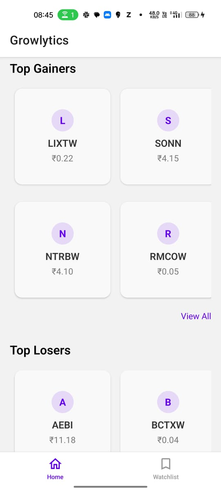
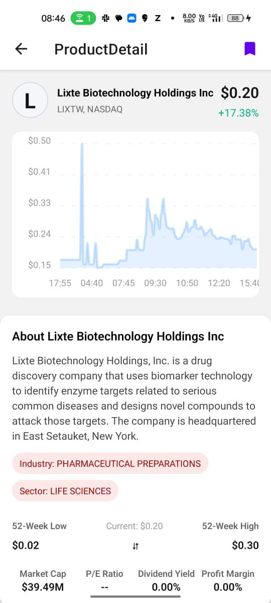
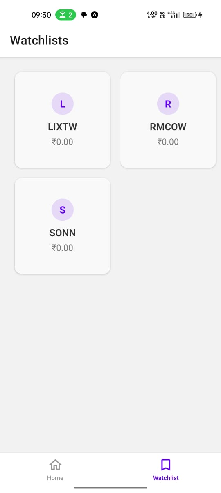
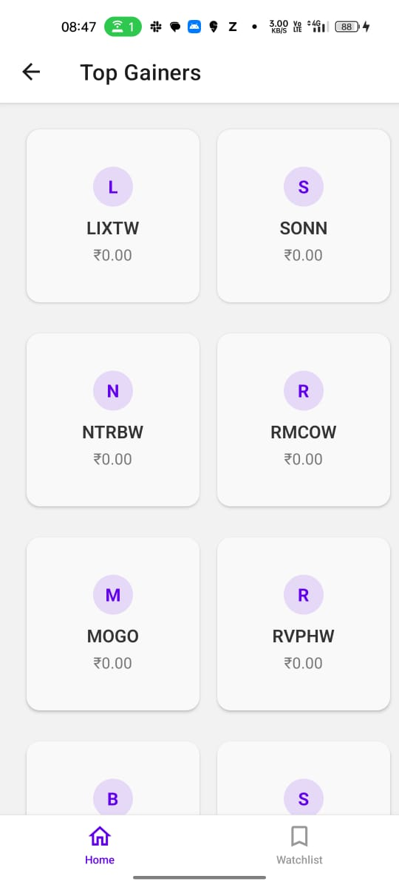

# 📈 Growlytics — Track Stocks Effortlessly

Growlytics is a minimalist stock & ETF tracking app built as part of the App Intern Assignment for Groww.

Explore top gainers and losers, dive into detailed stock charts, and manage your personalized watchlist — all in a React Native app!

---

## 🎯 Features

- 🔍 **Explore Screen**: View top gainers and losers via AlphaVantage API
- 📊 **Product Detail**: Line chart + company overview
- 🌟 **Watchlist**: Add/remove stocks and store them locally
- 🔄 **API Caching**: Prevents hitting AlphaVantage's 25-req/day limit
- 💥 **Fallback Handling**: Gracefully switches to mock data if quota is exceeded

---

## ⚙️ Tech Stack

| Layer        | Tools/Libraries                          |
|--------------|------------------------------------------|
| Framework    | React Native (Expo + TypeScript)         |
| UI Library   | react-native-paper, react-native-svg     |
| Navigation   | react-navigation (Stack + Bottom Tabs)   |
| Charts       | react-native-chart-kit                   |
| Data Fetching| axios                                     |
| Persistence  | AsyncStorage                              |
| Caching      | Custom TTL-based local cache layer       |

---

## 📸 Screenshots

> (All screens captured on Expo Go on Android)

<table>
  <tr>
    <td></td>
    <td></td>
  </tr>
  <tr>
    <td></td>
    <td></td>
  </tr>
</table>

---

## 🎥 Demo

👉 [Watch Demo Video](https://drive.google.com/file/d/1PUoRWfwpbzqc0j7azEwOLLQvOdPaZqGN/view?usp=sharing)

---j

## 📦 APK / Expo Link

👉 [Download APK](https://drive.google.com/file/d/1yiFw7xwOa8KamCljvsj3LX8olBySSOiq/view?usp=sharing)

---

## 🔍 Known Limitations

- ⛔ View All + Pagination pending
- ⛔ Limited UI polish (time constraints)

---

## 💡 Reflections

Working on Growlytics was an incredibly fun challenge.  
This was my **first time with React Native**, and I loved picking it up under pressure. It gave me deep appreciation for cross-platform UI design and native performance tradeoffs.

Given more time, I'd love to:
- Add sector filters, better charts, and light/dark themes
- Integrate Firebase or Supabase for cloud-based watchlists
- Deploy via EAS to production stores

---

Made with 💚 by Amlan 